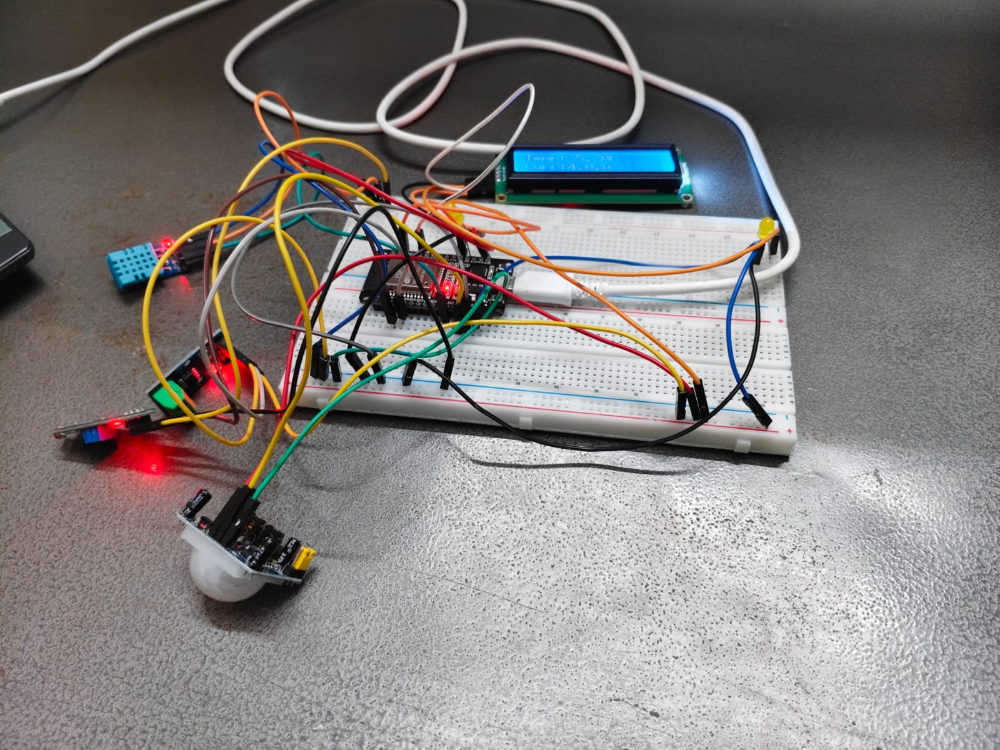

# 🏠 Smart Home Voice Control System

> A real-time, voice-activated smart home automation system built on **ESP32** + **Blynk IoT** + **Python Speech Recognition**. Control lights, monitor motion, and read live sensor data — all hands-free.


---

## 📋 Table of Contents

- [Project Overview](#project-overview)
- [System Architecture](#system-architecture)
- [Hardware Requirements](#hardware-requirements)
- [Software Requirements](#software-requirements)
- [Pin Configuration](#pin-configuration)
- [File Structure](#file-structure)
- [ESP32 Firmware](#esp32-firmware)
  - [Blynk Virtual Pin Map](#blynk-virtual-pin-map)
  - [Uploading the Firmware](#uploading-the-firmware)
- [Python Voice Control](#python-voice-control)
  - [Installation](#installation)
  - [Running the Script](#running-the-script)
  - [Supported Voice Commands](#supported-voice-commands)
  - [Command Normalization](#command-normalization)
- [Voice–PIR Conflict Resolution](#voicepir-conflict-resolution)
- [LCD Display Behavior](#lcd-display-behavior)
- [Sensor Details](#sensor-details)
- [Troubleshooting](#troubleshooting)
- [Configuration Reference](#configuration-reference)

---

## Project Overview

This system provides full smart home control by combining two independent layers:

| Layer | Technology | Role |
|---|---|---|
| **Firmware** | ESP32 + Blynk IoT | Controls hardware (relay, LEDs, sensors) and exposes virtual pins |
| **Voice Interface** | Python + Google Speech API | Listens to microphone, translates speech to Blynk API calls |

The Python script communicates directly with the Blynk Cloud REST API over HTTPS — **no third-party automation service (IFTTT, Google Home, Alexa) is required**. Your voice goes straight to the device.

---

## System Architecture

```
┌─────────────────────────────────────────────────────────────┐
│                    Your Computer (Python)                    │
│                                                             │
│  🎤 Microphone                                              │
│      │                                                      │
│      ▼                                                      │
│  SpeechRecognition ──► Google Speech API (cloud)            │
│      │                                                      │
│      ▼                                                      │
│  Command Processor                                          │
│   • Normalize text ("one" → "1", "turn on" → "on")         │
│   • Match intent                                            │
│   • Apply voice/PIR priority lock                           │
│      │                                                      │
│      ▼                                                      │
│  HTTPS GET Request                                          │
│  blynk.cloud/external/api/update?token=...&vX=Y             │
└──────────────────────────┬──────────────────────────────────┘
                           │
                    [ Internet ]
                           │
                           ▼
              ┌────────────────────────┐
              │      Blynk Cloud       │
              │  (Virtual Pin Router)  │
              └────────────┬───────────┘
                           │
                    [ WiFi / LAN ]
                           │
                           ▼
          ┌────────────────────────────────────┐
          │           ESP32 Device             │
          │                                   │
          │  BLYNK_WRITE(V1) → PIR Mode        │
          │  BLYNK_WRITE(V2) → LED (GPIO 2)    │
          │  BLYNK_WRITE(V3) → Relay (GPIO 26) │
          │                                   │
          │  ┌──────┐ ┌──────┐ ┌──────────┐  │
          │  │ PIR  │ │ DHT  │ │  ACS712  │  │
          │  │ GPIO │ │ GPIO │ │  GPIO 35 │  │
          │  │  13  │ │  14  │ └──────────┘  │
          │  └──────┘ └──────┘               │
          │  ┌──────────────────────────┐     │
          │  │    LCD 16x2 (I2C 0x27)   │     │
          │  │    SDA=21  SCL=22        │     │
          │  └──────────────────────────┘     │
          └────────────────────────────────────┘
```

---

## Hardware Requirements

| Component | Model / Spec | Quantity |
|---|---|---|
| Microcontroller | ESP32 (any variant) | 1 |
| PIR Motion Sensor | HC-SR501 | 1 |
| Temperature Sensor | DHT11 | 1 |
| Current Sensor | ACS712 (5A or 20A module) | 1 |
| LCD Display | 16×2 with I2C backpack (address `0x27`) | 1 |
| Relay Module | 5V single-channel relay | 1 |
| LED | Any color, 5mm | 1 |
| Resistor | 220Ω (for LED) | 1 |
| Microphone | Any USB or 3.5mm mic (for Python voice) | 1 |
| Power Supply | 5V / 2A USB or adapter | 1 |

---

## Software Requirements

### ESP32 (Arduino IDE)

| Library | Version | Install Via |
|---|---|---|
| `BlynkSimpleEsp32` | Latest | Library Manager |
| `DHT sensor library` | Latest | Library Manager (Adafruit) |
| `LiquidCrystal_I2C` | Latest | Library Manager |
| `WiFi` | Built-in | — |
| `Wire` | Built-in | — |

### Python Voice Control

| Package | Purpose |
|---|---|
| `SpeechRecognition` | Microphone capture + Google Speech transcription |
| `requests` | HTTPS calls to Blynk Cloud REST API |
| `threading` | Thread-safe voice/PIR priority locking |

> **Python version:** 3.7 or higher recommended.

---

## Pin Configuration

### ESP32 GPIO Map

| GPIO | Connected To | Direction | Notes |
|---|---|---|---|
| `13` | PIR Sensor (OUT) | INPUT | Motion detection |
| `14` | DHT11 (DATA) | INPUT | Temperature sensor |
| `35` | ACS712 (VOUT) | INPUT (ADC) | Analog current reading |
| `2` | LED | OUTPUT | Controlled via V2 |
| `26` | Relay Module (IN) | OUTPUT | Active LOW — `LOW` = ON |
| `21` | I2C SDA (LCD) | I2C | LCD data line |
| `22` | I2C SCL (LCD) | I2C | LCD clock line |

> ⚠️ **Relay polarity note:** The relay is active-LOW. `digitalWrite(RELAY1, LOW)` turns the light **ON**; `HIGH` turns it **OFF**. This is correctly handled in the firmware.

---

## File Structure

```
smart-home-voice-control/
│
├── Esp_code.ino          # ESP32 Arduino firmware
│   
├── voice_control.py            # Python voice controller (main script)
│
└── README.md                   # This file
```

---

## ESP32 Firmware

### Blynk Virtual Pin Map

| Virtual Pin | Name | Type | Values | Function |
|---|---|---|---|---|
| `V1` | PIR Mode | Integer | 0 / 1 | Enable (`1`) or disable (`0`) motion-triggered relay |
| `V2` | LED Control | Integer | 0 / 1 | Turn built-in LED on/off |
| `V3` | Relay (Light) | Integer | 0 / 1 | Control the mains relay (active load) |

> When `V3 = 1` (relay ON via voice or app), `manualLED4 = true` is set internally, which disables PIR auto-control until explicitly re-enabled via `V1 = 0 → V1 = 1` or a voice command.

### Blynk Template Configuration

Update the following at the top of your `.ino` file before uploading:

```cpp
#define BLYNK_TEMPLATE_ID   "YOUR_TEMPLATE_ID"
#define BLYNK_TEMPLATE_NAME "Smart Home Lighting"
#define BLYNK_AUTH_TOKEN    "YOUR_AUTH_TOKEN"
```

Also update your WiFi credentials:

```cpp
char ssid[] = "YOUR_WIFI_SSID";
char pass[] = "YOUR_WIFI_PASSWORD";
```

### Uploading the Firmware

1. Open **Arduino IDE** and install all required libraries via **Sketch → Include Library → Manage Libraries**.
2. Select your board: **Tools → Board → ESP32 Arduino → ESP32 Dev Module** (or your specific variant).
3. Set upload speed: **Tools → Upload Speed → 115200**.
4. Open `smart_home.ino`, update credentials (see above), and click **Upload**.
5. Open **Serial Monitor** at `115200 baud` to verify WiFi connection and Blynk handshake.

---

## Python Voice Control

### Installation

```bash
# Clone or download the project, then:
pip install SpeechRecognition requests pyaudio
```

> **On Linux**, if `pyaudio` fails to install:
> ```bash
> sudo apt-get install portaudio19-dev
> pip install pyaudio
> ```
>
> **On Windows**, if `pyaudio` fails:
> ```bash
> pip install pipwin
> pipwin install pyaudio
> ```

### Configuration

Open `voice_control.py` and update the Blynk auth token:

```python
AUTH_TOKEN = "YOUR_BLYNK_AUTH_TOKEN"
```

Optionally adjust the voice priority hold time (default: 5 seconds):

```python
VOICE_HOLD_SECONDS = 5
```

### Running the Script

```bash
python voice_control.py
```

On first launch, the script will:
1. Calibrate the microphone for ambient noise (1 second).
2. Begin listening in a continuous loop.
3. Print all recognized and normalized commands to the terminal.

**Example terminal output:**
```
=============================================
  🏠 Smart Home Voice Control  v2.0
=============================================
🔧 Calibrating microphone...
✅ Microphone ready!

🎤 Say a command...
🎤 You said: 'turn on light one'
🔄 Normalized: 'on light 1'
✅ V2 = 1 sent successfully
💡 LED1 ON
```

### Supported Voice Commands

| Say This | Action | Blynk Pin | Value |
|---|---|---|---|
| `"light 1 on"` / `"turn on light one"` | LED ON | V2 | 1 |
| `"light 1 off"` / `"turn off light one"` | LED OFF | V2 | 0 |
| `"light 2 on"` / `"turn on light two"` | Relay ON | V3 | 1 |
| `"light 2 off"` / `"turn off light two"` | Relay OFF | V3 | 0 |
| `"pir on"` / `"motion on"` / `"sensor on"` | Enable PIR | V1 | 1 |
| `"pir off"` / `"motion off"` / `"sensor off"` | Disable PIR | V1 | 0 |
| `"all on"` / `"lights on"` / `"everything on"` | All ON | V1+V2+V3 | 1 |
| `"all off"` / `"lights off"` / `"everything off"` | All OFF | V1+V2+V3 | 0 |

### Command Normalization

The script automatically handles common speech recognition mishearings and variations:

| Spoken | Interpreted As |
|---|---|
| `"one"`, `"won"` | `"1"` |
| `"two"`, `"to"`, `"too"` | `"2"` |
| `"turn on"`, `"switch on"`, `"enable"`, `"activate"` | `"on"` |
| `"turn off"`, `"switch off"`, `"disable"`, `"deactivate"` | `"off"` |
| `"led"`, `"lie"`, `"lied"` | `"light"` |

This allows natural phrasing like *"activate light one"* or *"enable light 2"* to work correctly.

---

## Voice–PIR Conflict Resolution

One of the key design features of this system is **voice command priority over PIR (motion sensor) automation**.

### The Problem

Without a priority system, the PIR sensor could override a voice command immediately — e.g., you say "lights off" but the PIR detects residual motion and turns them back on within milliseconds.

### The Solution

A **thread-safe timestamp lock** (`threading.Lock`) records the time of every successful voice command. For the next `VOICE_HOLD_SECONDS` seconds (default: 5), any PIR-triggered action is **silently blocked**.

```
Voice command issued
        │
        ▼
  last_voice_time = now()          ← stamped BEFORE executing
        │
        ▼
  Action executed (LED/Relay)
        │
     (5 seconds pass)
        │
        ▼
  PIR resumes normal operation
```

**Console output when PIR is blocked:**
```
📡 PIR Event: ON triggered
⚠️  PIR blocked — voice has priority (3.2s remaining)
```

---

## LCD Display Behavior

The LCD alternates every **5 seconds** between two information screens:

**Screen 1 — Motion & Light Status:**
```
Motion:Detected
Light:ON
```

**Screen 2 — Environment Data:**
```
Temp:28.5C
Curr:0.42A
```

The display also updates immediately upon voice commands (e.g., shows `All Lights ON` or `All Lights OFF` when triggered).

---

## Sensor Details

### DHT11 — Temperature

- Reads temperature in Celsius every 2 seconds via `readSensors()` timer.
- Data is displayed on the LCD and can be extended to Blynk dashboard widgets on a `V4`/`V5` datastream if needed.

### ACS712 — Current Sensor

- Raw ADC reading from GPIO 35 (12-bit, 0–4095).
- Converted to voltage: `volts = (raw / 4095.0) × 3.3`
- Converted to current: `current = (volts − 1.65) / 0.185` *(calibrated for ACS712-5A module)*
- Absolute value displayed: `abs(current)` to avoid negative readings from bidirectional flow.

> For the **ACS712-20A** variant, change the sensitivity from `0.185` to `0.100`.

### HC-SR501 — PIR Motion Sensor

- Polled every **300ms** in `checkMotion()`.
- When motion is detected (`HIGH`): relay turns ON, V1 is written `1` to Blynk.
- When no motion (`LOW`): relay turns OFF, V1 written `0`.
- PIR control is suppressed when `manualLED4 = true` (manual/voice override is active).

---

## Troubleshooting

| Symptom | Likely Cause | Fix |
|---|---|---|
| ESP32 won't connect to WiFi | Wrong SSID/password | Double-check `ssid[]` and `pass[]` in firmware |
| Blynk shows device offline | Auth token mismatch | Verify `BLYNK_AUTH_TOKEN` matches Blynk Console |
| `pyaudio` install fails | Missing PortAudio | Install system dependency (`portaudio19-dev` on Linux) |
| Voice not recognized | Poor mic / loud environment | Move to quieter space; adjust `energy_threshold` in script |
| Commands recognized but not sent | Wrong auth token in Python | Update `AUTH_TOKEN` in `voice_control.py` |
| Relay stays ON after "lights off" | PIR re-triggering | Voice hold may have expired; increase `VOICE_HOLD_SECONDS` |
| LCD shows garbage characters | Wrong I2C address | Scan I2C bus; change `0x27` to `0x3F` if needed |
| Current reading is always ~0A | ACS712 not powered correctly | Ensure 5V supply to ACS module; check wiring |
| "Command not recognized" every time | Normalization not matching | Print raw `command` before normalization; add phrases to `process_command()` |

---

## Configuration Reference

### Python Script (`voice_control.py`)

| Variable | Default | Description |
|---|---|---|
| `AUTH_TOKEN` | `"..."` | Blynk auth token — **must match firmware** |
| `VOICE_HOLD_SECONDS` | `5` | Seconds voice command blocks PIR override |
| `energy_threshold` | `300` | Mic sensitivity (lower = picks up quieter sounds) |
| `pause_threshold` | `0.5` | Seconds of silence to mark end of phrase |
| `phrase_time_limit` | `3` | Max seconds to record a single command |

### Firmware (`smart_home.ino`)

| Constant | Default | Description |
|---|---|---|
| `PIR_PIN` | `13` | GPIO for PIR signal output |
| `RELAY1` | `26` | GPIO for relay control (active LOW) |
| `DHT_PIN` | `14` | GPIO for DHT11 data |
| `ACS_PIN` | `35` | ADC GPIO for ACS712 analog output |
| `LED_PIN` | `2` | GPIO for onboard/external LED |
| Timer: `checkMotion` | `300ms` | PIR polling interval |
| Timer: `readSensors` | `2000ms` | DHT11 + ACS read interval |
| Timer: `updateLCD` | `5000ms` | LCD refresh interval |


---

*Built with ESP32, Blynk IoT, and Python SpeechRecognition.*
